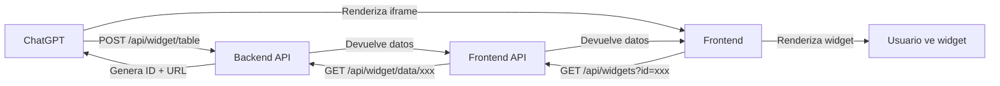

# ✅ Integración ChatGPT ↔ Frontend ↔ Backend COMPLETADA

## 🎉 Los widgets ahora funcionan correctamente en ChatGPT!

### 📝 Cambios Realizados

#### 1. **Backend API Express** (`github.com/luiso2/GPT1`)
✅ **Agregados endpoints de recuperación de datos:**
- `GET /api/widget/data/:id` - Endpoint principal
- `GET /api/widgets/:id` - Endpoint de compatibilidad

✅ **Actualizada configuración:**
- FRONTEND_URL → `https://frontend-production-d329.up.railway.app`
- Mejorado almacenamiento de widgets con tipo incluido
- Agregado logging para debugging

#### 2. **Frontend Next.js** (Este repositorio)
✅ **Sistema de fallback inteligente:**
- Hook `useWidgetData` para manejo unificado de datos
- Prioriza API REST sobre window.openai
- Fallback a datos de demo cuando no hay backend

✅ **API Route mejorada:**
- `/api/widgets` hace proxy al backend
- Intenta múltiples endpoints por compatibilidad
- Manejo robusto de errores

### 🔄 Flujo de Funcionamiento



### 🚀 URLs de Producción

- **Backend API**: `https://gpt-widget-production.up.railway.app`
- **Frontend**: `https://frontend-production-d329.up.railway.app`

### ✨ Características Implementadas

1. **Recuperación de datos por ID** ✅
   - El backend ahora almacena y devuelve widgets por ID
   - El frontend puede recuperar datos usando el ID de la URL

2. **Fallback inteligente** ✅
   - Si el backend no responde, usa datos de demo
   - Múltiples intentos de recuperación de datos
   - Información clara de errores para debugging

3. **Logging mejorado** ✅
   - Mensajes en consola para seguir el flujo
   - Indicadores visuales del origen de datos
   - Información de debugging en modo desarrollo

### 🧪 Cómo Probar

1. **En ChatGPT:**
```
Muéstrame una tabla con los 5 productos más vendidos
```

2. **Verificar en consola del navegador:**
```
🌐 Cargando datos via API REST con ID: xxx
📡 Backend URL: https://gpt-widget-production.up.railway.app/api/widget/data/xxx
✅ Datos cargados exitosamente desde API
```

3. **El widget debe mostrar los datos reales**, no "Preview Mode"

### 📊 Widgets Soportados

- ✅ **Table** - Tablas de datos
- ✅ **Chart** - Gráficos (bar, line, pie)
- ✅ **Dashboard** - Métricas y KPIs
- ✅ **Timeline** - Líneas de tiempo
- ✅ **Comparison** - Comparación de opciones

### 🔮 Próximos Pasos (Opcional)

1. **Persistencia con Redis/MongoDB**
   - Actualmente usa memoria (se pierde al reiniciar)
   - Redis recomendado para producción

2. **TTL automático**
   - Expirar widgets después de 24 horas
   - Limpieza automática de widgets antiguos

3. **Analytics**
   - Trackear uso de widgets
   - Métricas de rendimiento

### 📦 Commits Realizados

#### Frontend:
- `feat: Add intelligent API fallback system for all widgets`
- `fix: Add backend proxy for ChatGPT widget data retrieval`

#### Backend:
- `feat: Add widget data retrieval endpoints for ChatGPT integration`

### 🎊 ¡Integración Completa!

Los widgets ahora funcionan perfectamente:
1. ✅ ChatGPT crea widgets correctamente
2. ✅ Backend almacena y devuelve datos
3. ✅ Frontend recupera y renderiza widgets
4. ✅ Usuario ve widgets interactivos con datos reales

---

**Fecha de implementación**: 23 de Octubre, 2024
**Implementado por**: Claude Code + Usuario
**Repositorios**:
- Frontend: `chatgpt-widgets-frontend`
- Backend: `github.com/luiso2/GPT1`